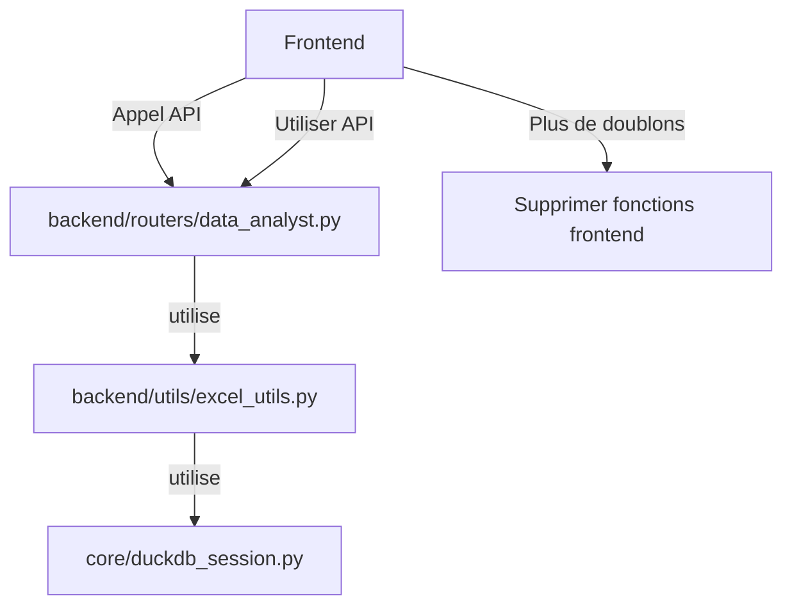

# Analyse des Redondances entre Backend et Frontend

## Fichiers Analysés

1. **backend/routers/data_analyst.py** - Routeur API pour l'analyse de données
2. **frontend/plugins/general_purpose_chat_ui.py** - Interface de chat généraliste
3. **backend/utils/excel_utils.py** - Utilitaires Excel backend

## Redondances Identifiées

### 1. Fonctions Doublons Exactes

#### `extraire_sql_et_metadata()`

**Backend (utils/excel_utils.py)**:
```python
def extraire_sql_et_metadata(llm_response: str) -> tuple[Optional[str], Dict[str, str]]:
    """
    Extrait le code SQL et les métadonnées de graphique de la réponse LLM.
    """
    sql_match = re.search(r"```sql\n(.*?)\n```", llm_response, re.DOTALL)
    if not sql_match:
        return None, {}

    bloc = sql_match.group(1).strip()
    chart_meta = {}
    for key in ["CHART_TYPE", "CHART_X", "CHART_Y", "CHART_TITLE", "CHART_COLOR"]:
        m = re.search(rf"--\s*{key}:\s*(.+)", bloc)
        if m:
            chart_meta[key] = m.group(1).strip()

    lignes_sql = [l for l in bloc.splitlines() if not l.strip().startswith("--")]
    sql_pur = "\n".join(lignes_sql).strip()
    return sql_pur, chart_meta
```

**Frontend (general_purpose_chat_ui.py)**:
```python
def extraire_sql_et_metadata(llm_response: str) -> tuple[str | None, dict]:
    """
    Extrait le SQL et les métadonnées de graphique d'une réponse LLM.
    """
    sql_match = re.search(r"```sql\n(.*?)\n```", llm_response, re.DOTALL)
    if not sql_match:
        return None, {}

    bloc = sql_match.group(1).strip()
    chart_meta = {}
    for key in ["CHART_TYPE", "CHART_X", "CHART_Y", "CHART_TITLE", "CHART_COLOR"]:
        m = re.search(rf"--\s*{key}:\s*(.+)", bloc)
        if m:
            chart_meta[key] = m.group(1).strip()

    lignes_sql = [l for l in bloc.splitlines() if not l.strip().startswith("--")]
    sql_pur = "\n".join(lignes_sql).strip()
    return sql_pur, chart_meta
```

**Analyse**:
- **Fonction identique** à 100% (même logique, même regex, même retour)
- **Problème**: Duplication inutile - la fonction devrait être dans un seul endroit
- **Solution**: Garder uniquement dans `backend/utils/excel_utils.py` et faire appel via API

#### `construire_graphe()`

**Backend (utils/excel_utils.py)**:
```python
def construire_graphe(df: pd.DataFrame, meta: Dict[str, str]) -> Optional[Dict[str, Any]]:
    """
    Construit un graphique à partir des données et des métadonnées et retourne une spécification JSON.
    """
    # Retourne une spécification JSON pour Plotly
```

**Frontend (general_purpose_chat_ui.py)**:
```python
def construire_graphe(df: pd.DataFrame, meta: dict) -> go.Figure | None:
    """
    Construit un graphique localement à partir d'un DataFrame et de métadonnées.
    """
    # Retourne un objet Plotly Figure
```

**Analyse**:
- **Logique similaire** mais implémentations différentes
- Backend: Retourne une spécification JSON
- Frontend: Retourne un objet Plotly Figure directement
- **Problème**: Deux implémentations pour la même fonctionnalité
- **Solution**: Standardiser sur une seule approche (probablement backend)

#### `executer_sql_backend()`

**Backend (utils/excel_utils.py)**:
```python
def executer_sql_backend(sql: str, session_id: str) -> pd.DataFrame:
    """
    Exécute une requête SQL via le backend DuckDB et retourne les résultats.
    """
    # Utilise core.duckdb_session
```

**Frontend (general_purpose_chat_ui.py)**:
```python
def executer_sql_backend(sql: str) -> pd.DataFrame | None:
    """
    Exécute SQL via le backend et retourne les résultats.
    """
    # Fait un appel API à /execute_sql
```

**Analyse**:
- **Fonctionnalité identique** mais implémentations différentes
- Backend: Accès direct à DuckDB
- Frontend: Appel API au backend
- **Problème**: Le frontend a une fonction qui fait exactement ce que le backend fait déjà
- **Solution**: Supprimer la fonction frontend et utiliser directement l'API

### 2. Fonctions Similaires mais Non Identiques

#### Gestion des Graphiques

**Backend (data_analyst.py)**:
- `/build_chart` - Construit un graphique à partir de données et métadonnées
- `/build_chart_from_llm` - Construit à partir d'une réponse LLM complète
- Retourne des spécifications JSON

**Frontend (general_purpose_chat_ui.py)**:
- `construire_graphe()` - Construit directement un objet Plotly Figure
- Gestion intégrée dans `render_general_purpose_chat()`

**Analyse**:
- **Approches différentes** pour la même finalité
- Backend: Architecture API avec spécifications JSON
- Frontend: Construction directe des graphiques
- **Problème**: Incohérence architecturale
- **Solution**: Choisir une approche et la standardiser

### 3. Fonctions Uniquement dans Backend (Non Utilisées)

**backend/utils/excel_utils.py**:
- `construire_graphe_from_chart_tag()` - Gestion du format `<chart>` tag
- `analyser_reponse_excel()` - Analyse complète des réponses LLM

**Analyse**:
- Ces fonctions existent dans le backend mais ne sont pas utilisées par le frontend
- **Problème**: Fonctionnalités backend non exploitées
- **Solution**: Soit les utiliser dans le frontend, soit les supprimer

## Recommandations de Nettoyage

### 1. Supprimer les Doublons Frontend

**Fichiers à modifier**:
- `frontend/plugins/general_purpose_chat_ui.py`

**Actions**:
```bash
# Supprimer les fonctions suivantes (lignes 78-143):
- extraire_sql_et_metadata()
- construire_graphe()
- executer_sql_backend()
```

**Remplacer par**:
```python
# Utiliser les endpoints API backend existants:
# - POST /extract_sql_metadata
# - POST /build_chart
# - POST /execute_sql
```

### 2. Standardiser sur l'API Backend

**Avantage**:
- Architecture plus propre (séparation frontend/backend)
- Moins de duplication de code
- Maintenance plus facile

**Implémentation**:
```python
# Dans general_purpose_chat_ui.py, remplacer:
# sql, chart_meta = extraire_sql_et_metadata(full_response)
# par:
response = requests.post(f"{API_URL}/extract_sql_metadata", json={"llm_response": full_response})
if response.status_code == 200:
    data = response.json()
    sql = data.get("sql")
    chart_meta = data.get("chart_meta")
```

### 3. Utiliser les Fonctions Backend Non Exploitées

**Fonctions à intégrer**:
- `construire_graphe_from_chart_tag()` - Pour le nouveau format `<chart>`
- `analyser_reponse_excel()` - Pour une analyse plus complète

**Bénéfices**:
- Meilleure réutilisation du code
- Cohérence entre frontend et backend
- Fonctionnalités avancées disponibles

### 4. Architecture Recommandée



## Impact du Nettoyage

### Avantages

1. **Réduction de la duplication**: ~150 lignes de code en moins dans le frontend
2. **Meilleure maintenance**: Une seule source de vérité pour chaque fonctionnalité
3. **Architecture plus claire**: Séparation nette entre frontend et backend
4. **Évolutivité**: Plus facile d'ajouter de nouvelles fonctionnalités

### Risques Potentiels

1. **Latence réseau**: Plus d'appels API au lieu de traitement local
   - **Mitigation**: Les appels sont déjà faits, juste réorganisés
2. **Changements de comportement**: Comportement légèrement différent
   - **Mitigation**: Tests approfondis nécessaires

### Étapes de Migration

1. **Étape 1**: Ajouter les endpoints manquants dans le backend si nécessaire
2. **Étape 2**: Modifier le frontend pour utiliser les endpoints API
3. **Étape 3**: Tester exhaustivement chaque fonctionnalité
4. **Étape 4**: Supprimer les fonctions doublons du frontend
5. **Étape 5**: Documenter la nouvelle architecture

## Conclusion

Il y a effectivement une **redondance significative** entre les trois fichiers analysés. Les fonctions `extraire_sql_et_metadata()`, `construire_graphe()`, et `executer_sql_backend()` existent en doublons avec des implémentations très similaires.

**Recommandation principale**: Supprimer les implémentations frontend et standardiser sur l'utilisation des endpoints API backend, ce qui créera une architecture plus propre et plus maintenable.