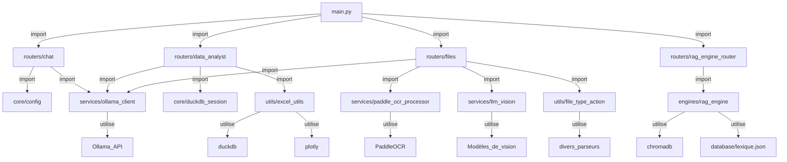
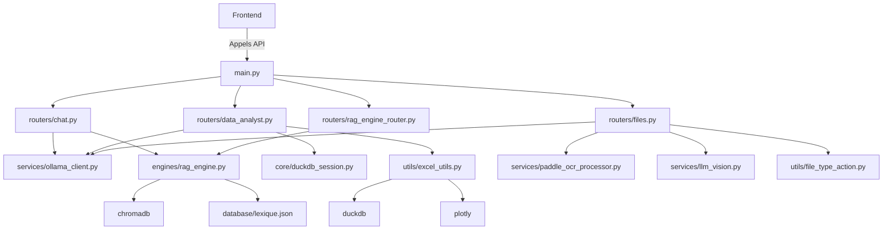

# Mapping de l'application Backend

## Structure globale

```
backend/
├── Dockerfile                       # Configuration Docker avec CUDA et dépendances
├── main.py                         # Point d'entrée FastAPI
├── requirements_backend.txt        # Dépendances Python
├── tiktoken_cache/                 # Cache pour tiktoken
├── core/
│   ├── config.py                   # Configuration système et prompts
│   └── duckdb_session.py           # Gestion des sessions DuckDB
├── database/
│   └── lexique.json                # Base de données lexique
├── engines/
│   └── rag_engine.py               # Moteur RAG principal
├── routers/
│   ├── chat_rag.py                 # Routeur pour le chat RAG
│   ├── chat.py                     # Routeur pour le chat standard
│   ├── data_analyst.py             # Routeur pour l'analyse de données
│   ├── files.py                    # Routeur pour la gestion des fichiers
│   └── rag_engine_router.py        # Routeur pour le moteur RAG
├── services/
│   ├── llm_vision.py               # Service de vision LLM
│   ├── ollama_client.py            # Client Ollama pour les modèles LLM
│   └── paddle_ocr_processor.py     # Service OCR avec PaddleOCR
└── utils/
    ├── excel_utils.py              # Utilitaires pour Excel
    ├── file_type_action.py         # Gestion des types de fichiers
    ├── llmlingua_format.py         # Formatage LLMLingua
    └── new_xlsx_parser.py          # Parseur XLSX avancé
```

## Diagramme de dépendances



## Détails des dépendances

### Point d'entrée

1. **main.py**
   - Point d'entrée FastAPI
   - Import et inclut les routeurs principaux:
     - `chat` pour les conversations standard
     - `data_analyst` pour l'analyse de données
     - `files` pour la gestion des fichiers
     - `rag_engine_router` pour le moteur RAG

### Routeurs principaux

1. **routers/chat.py**
   - Gère les conversations standard et RAG
   - Dépendances:
     - `core.config` pour les prompts système
     - `services.ollama_client` pour l'inférence LLM
     - Modèles Pydantic pour la validation

2. **routers/data_analyst.py**
   - Gère l'analyse de données et les requêtes SQL
   - Dépendances:
     - `core.duckdb_session` pour les sessions DuckDB
     - `services.ollama_client` pour l'inférence LLM
     - `utils.excel_utils` pour les utilitaires Excel

3. **routers/files.py**
   - Gère le téléchargement et le traitement des fichiers
   - Dépendances:
     - `services.ollama_client` pour l'inférence LLM
     - `services.paddle_ocr_processor` pour l'OCR
     - `services.llm_vision` pour la vision par ordinateur
     - `utils.file_type_action` pour la gestion des types de fichiers

4. **routers/rag_engine_router.py**
   - Routeur pour le moteur RAG
   - Dépendances:
     - `engines.rag_engine` pour le moteur RAG principal

### Services

1. **services/ollama_client.py**
   - Client pour l'API Ollama
   - Fournit l'inférence LLM pour tous les routeurs
   - Dépendances externes: Ollama API

2. **services/paddle_ocr_processor.py**
   - Service OCR utilisant PaddleOCR
   - Utilisé pour l'extraction de texte des images et PDF
   - Dépendances externes: PaddleOCR

3. **services/llm_vision.py**
   - Service de vision LLM
   - Utilisé pour l'analyse d'images et documents
   - Dépendances externes: Modèles de vision

### Moteurs

1. **engines/rag_engine.py**
   - Moteur RAG principal
   - Gère la recherche et la récupération augmentée
   - Dépendances:
     - ChromaDB pour la base de données vectorielle
     - `database/lexique.json` pour le lexique

### Utilitaires

1. **utils/excel_utils.py**
   - Utilitaires pour le traitement Excel
   - Fonctions: extraction SQL, construction de graphiques, exécution SQL
   - Dépendances: duckdb, plotly

2. **utils/file_type_action.py**
   - Gestion des différents types de fichiers
   - Détermine les actions à prendre pour chaque type de fichier

3. **utils/llmlingua_format.py**
   - Formatage LLMLingua
   - Utilisé pour le traitement du langage naturel

4. **utils/new_xlsx_parser.py**
   - Parseur XLSX avancé
   - Utilisé pour l'analyse des fichiers Excel

### Core

1. **core/config.py**
   - Configuration système et prompts
   - Contient les prompts système et paramètres globaux

2. **core/duckdb_session.py**
   - Gestion des sessions DuckDB
   - Utilisé pour les requêtes SQL sur les fichiers

### Base de données

1. **database/lexique.json**
   - Base de données lexique
   - Utilisée par le moteur RAG

## Architecture fonctionnelle



## Flux de données principaux

1. **Flux de chat standard**:
   - Frontend → `/chat` → `routers/chat.py` → `services/ollama_client.py` → Modèle LLM → Réponse

2. **Flux RAG**:
   - Frontend → `/rag/*` → `routers/rag_engine_router.py` → `engines/rag_engine.py` → ChromaDB → Réponse enrichie

3. **Flux d'analyse de données**:
   - Frontend → `/data_analyst` → `routers/data_analyst.py` → `utils/excel_utils.py` → DuckDB → Graphiques

4. **Flux de traitement de fichiers**:
   - Frontend → `/files` → `routers/files.py` → Services appropriés (OCR, Vision, etc.) → Contenu extrait

## Points clés de l'architecture

1. **Modularité**: Chaque composant a une responsabilité claire
2. **Réutilisabilité**: Les services comme `ollama_client` sont utilisés par plusieurs routeurs
3. **Séparation des préoccupations**: Routeurs pour la logique API, services pour la logique métier
4. **Extensibilité**: Nouvelle fonctionnalité peut être ajoutée en créant de nouveaux routeurs/services

## Recommandations pour le nettoyage

1. **Vérifier les dépendances inutilisées**:
   - Certaines bibliothèques dans `requirements_backend.txt` pourraient ne pas être utilisées
   - Vérifier les imports non utilisés dans les fichiers

2. **Standardiser les structures**:
   - S'assurer que tous les routeurs suivent le même pattern
   - Uniformiser les réponses API

3. **Documentation**:
   - Ajouter des docstrings complètes à toutes les fonctions
   - Documenter les endpoints API avec des exemples

4. **Gestion des erreurs**:
   - Standardiser la gestion des erreurs à travers l'API
   - Ajouter des logs appropriés

## Comparaison Frontend/Backend

| Aspect          | Frontend                          | Backend                           |
|-----------------|-----------------------------------|-----------------------------------|
| **Technologie** | Streamlit                         | FastAPI                          |
| **Rôle**        | Interface utilisateur             | Logique métier et API             |
| **Structure**   | Composants UI modulaires          | Routeurs et services modulaires  |
| **Spécialisation** | Chatbot généraliste + RH spécialisé | Moteurs RAG + Analyse de données |

Ce mapping fournit une vue complète de l'architecture backend et de ses relations avec le frontend.