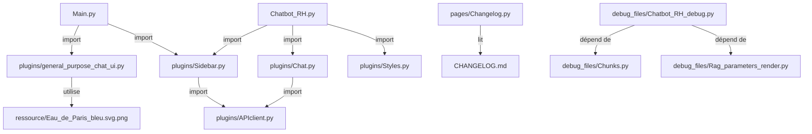

# Mapping de l'application Frontend

## Structure globale

```
frontend/
├── Main.py                          # Point d'entrée principal (chatbot généraliste)
├── CHANGELOG.md                     # Journal des modifications
├── Dockerfile                       # Configuration Docker
├── requirements_frontend.txt        # Dépendances Python
├── debug_files/                     # Fichiers de débogage (non utilisés actuellement)
│   ├── Chatbot_RH_debug.py         # Version debug du chatbot RH
│   ├── Chunks.py                   # Composant chunks pour débogage
│   └── Rag_parameters_render.py    # Rendu des paramètres RAG pour débogage
├── pages/
│   ├── Changelog.py                # Page d'affichage du changelog
│   └── Chatbot_RH.py               # Page du chatbot RH spécialisé
├── plugins/
│   ├── general_purpose_chat_ui.py # Interface de chat généraliste (anciennement chat_ui.py)
│   ├── APIclient.py                # Client API pour le backend
│   ├── Chat.py                     # Composant de chat RH
│   ├── Sidebar.py                  # Composant de sidebar
│   └── Styles.py                   # Styles CSS
└── ressource/
    └── Eau_de_Paris_bleu.svg.png    # Logo de l'application
```

## Diagramme de dépendances



## Détails des dépendances

### Fichiers principaux

1. **Main.py** (Chatbot Généraliste)
   - Point d'entrée principal de l'application
   - Import et utilise:
     - `render_general_purpose_chat` depuis `plugins/general_purpose_chat_ui.py`
     - `render_save_chat` depuis `plugins/Sidebar.py`
   - **Rôle** : Interface générale pour le traitement de fichiers et demandes variées

2. **Chatbot_RH.py** (dans pages/)
   - Page du chatbot spécialisé RH
   - Import et utilise:
     - `render_styles` depuis `plugins/Styles.py`
     - `render_save_chat` depuis `plugins/Sidebar.py`
     - `render_rag_chat` depuis `plugins/Chat.py`
   - **Rôle** : Interface spécialisée pour les questions RH de Eau de Paris

### Composants réutilisables

1. **plugins/general_purpose_chat_ui.py** (anciennement chat_ui.py)
   - Interface de chat généraliste avec support multi-fichiers
   - Fonction principale: `render_general_purpose_chat()`
   - Utilise le logo: `ressource/Eau_de_Paris_bleu.svg.png`
   - **Fonctionnalités** :
     - Gestion unifiée de session
     - Traitement de fichiers Excel, Word, PDF, etc.
     - Exécution SQL et génération de graphiques

2. **plugins/APIclient.py**
   - Client HTTP pour communiquer avec le backend
   - Utilisé par:
     - `plugins/Sidebar.py`
     - `plugins/Chat.py`

3. **plugins/Sidebar.py**
   - Contient une fonction :
     - `render_save_chat()`: Pour la sauvegarde/restauration des conversations
   - Utilisé par:
     - `Main.py`
     - `Chatbot_RH.py`

4. **plugins/Chat.py**
   - Composant de chat avec pipeline RAG complet pour les questions RH
   - Utilisé par:
     - `Chatbot_RH.py`

5. **plugins/Styles.py**
   - Injection des styles CSS globaux
   - Utilisé par:
     - `Chatbot_RH.py`

### Pages spécialisées

1. **pages/Changelog.py**
   - Affiche le contenu du fichier CHANGELOG.md
   - Lit directement: `CHANGELOG.md`

2. **pages/Chatbot_RH.py**
   - Interface de chatbot spécialisé RH
   - Utilise les composants RAG pour accéder à la base de connaissances RH

### Ressources

1. **ressource/Eau_de_Paris_bleu.svg.png**
   - Logo utilisé par les interfaces principales
   - Référencé dans:
     - `plugins/general_purpose_chat_ui.py`

### Fichiers de débogage (non utilisés actuellement)

1. **debug_files/Chatbot_RH_debug.py**
   - Version alternative de Chatbot_RH.py avec fonctionnalités de débogage
   - Utilise des composants spécifiques pour le débogage

2. **debug_files/Chunks.py**
   - Version alternative de l'affichage des chunks pour le débogage
   - Fonctions: `render_chunk_card()`, `render_chunks_panel()`

3. **debug_files/Rag_parameters_render.py**
   - Version alternative du rendu des paramètres RAG pour le débogage
   - Fonction: `render_sidebar()` pour configuration RAG détaillée

## Architecture fonctionnelle

L'application suit une architecture modulaire où:

1. **Main.py** sert de point d'entrée principal pour le chatbot généraliste utilisant `general_purpose_chat_ui.py`
2. **Chatbot_RH.py** offre une interface spécialisée RH utilisant les composants RAG
3. Les composants dans `plugins/` sont réutilisables et indépendants (pas tout à fait indépendants, ils fonctionnent ensembles)
4. Les fichiers dans `debug_files/` sont des alternatives pour le débogage (non utilisées en production)

## Points de nettoyage et optimisation

### Fichiers non utilisés (priorité moyenne - potentiellement utiles pour débogage)

1. **debug_files/** :
   - Fichiers de débogage actuellement non utilisés
   - **Recommandation** : Conserver pour le débogage futur, mais documenter clairement leur statut

### Améliorations potentielles

1. **Clarifier l'architecture** :
   - Documenter clairement la distinction entre les composants de production et de débogage
   - Ajouter des commentaires dans le code pour expliquer les choix d'architecture

2. **Optimiser les imports** :
   - S'assurer que tous les imports dans `frontend_mapping.md` sont à jour
   - Vérifier que les anciens fichiers (`renders/chat_ui.py`) n'existent plus

3. **Documentation** :
   - Clarifier le rôle des fichiers de débogage dans l'architecture globale

## Historique des changements récents

1. **Renommage de fichiers** :
   - `plugins/chat_ui.py` → `plugins/general_purpose_chat_ui.py`
   - `render_bare_chat()` → `render_general_purpose_chat()`

2. **Réorganisation** :
   - Suppression du dossier `renders/`
   - Déplacement des interfaces dans `plugins/`

3. **Ajouts** :
   - Dossier `debug_files/` pour les fonctionnalités de débogage
   - Clarification des rôles entre chatbot généraliste et spécialisé RH