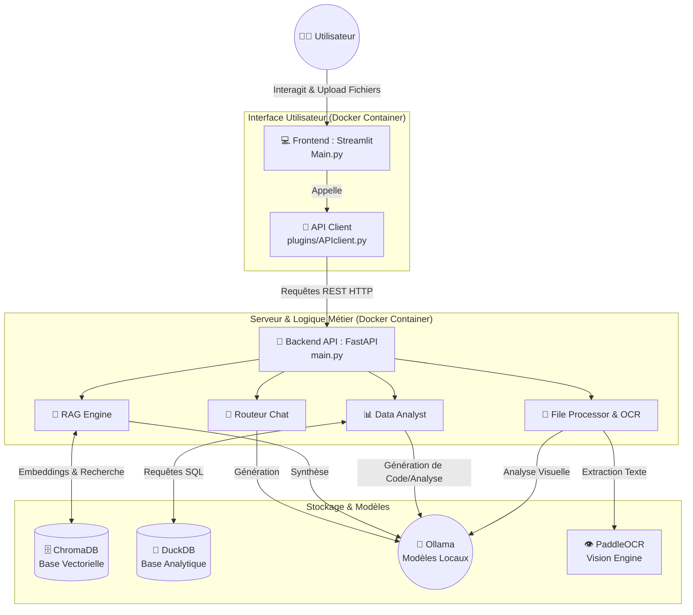

# 🤖 Chatbot IA & Assistant d'Analyse de Données

Un assistant conversationnel avancé d'entreprise, doté de capacités de génération augmentée par la recherche (RAG), d'analyse de données structurées et de reconnaissance optique de caractères (OCR). Ce projet est conçu avec une architecture moderne séparant le frontend et le backend, et s'appuie sur des modèles de langage locaux via Ollama.

## ✨ Fonctionnalités Principales

* **Interface Utilisateur Intuitive :** Développée avec Streamlit pour une interaction fluide avec le chatbot, l'upload de fichiers et le paramétrage.
* **Moteur RAG (Retrieval-Augmented Generation) :** Recherche intelligente dans vos documents grâce à une base de données vectorielle intégrée (ChromaDB).
* **Analyse de Données Avancée :** Analyse de fichiers Excel et exécution de requêtes via DuckDB.
* **Vision & OCR :** Extraction de texte à partir de documents complexes ou d'images en utilisant PaddleOCR et des modèles de vision LLM.
* **Confidentialité & Localisation :** Intégration complète avec [Ollama](https://ollama.com/) pour faire tourner les modèles de langage (LLM) localement.
* **Déploiement Facile :** Entièrement conteneurisé avec Docker et Docker Compose.

## 🏗 Architecture du Projet

Le projet suit une architecture client-serveur classique, avec des micro-services spécialisés pour la manipulation des données et l'inférence des modèles IA.

Voici le diagramme de flux de l'architecture :



### Explication des composants :

* **Frontend (Streamlit) :** Gère l'affichage, les sessions de chat, et l'envoi des documents (`Main.py`). Il communique exclusivement avec le backend via des requêtes HTTP.
* **Backend (FastAPI) :** Le point d'entrée de toute la logique. Il route les requêtes vers les bons services (Chat, RAG, Analyse de données).
* **Ollama :** Exécute les LLMs (comme Llama 3, Mistral, etc.) pour garantir la rapidité et la confidentialité des données.
* **Bases de Données :** * **ChromaDB :** Stocke les embeddings des documents pour le RAG.
  * **DuckDB :** Permet d'effectuer des analyses SQL rapides sur les données tabulaires (ex: fichiers Excel uploadés).

## 📂 Structure du Dépôt

```text
chatbot-master/
├── docker-compose.yml       # Configuration globale des conteneurs
├── backend/                 # Serveur FastAPI
│   ├── main.py              # Point d'entrée de l'API
│   ├── routers/             # Points finaux (chat, files, rag, analyst)
│   ├── engines/             # Logique métier (RAG engine)
│   ├── services/            # Intégrations tierces (Ollama, OCR, Vision)
│   ├── core/                # Configuration et DB sessions (DuckDB)
│   └── utils/               # Outils de parsing (Excel, formattage)
├── frontend/                # Application Streamlit
│   ├── Main.py              # Page principale du chat
│   ├── pages/               # Pages secondaires (Changelog)
│   ├── plugins/             # Composants UI et client API
│   └── debug_files/         # Outils de débogage pour les développeurs
└── _data/                   # Stockage persistant (ChromaDB SQLite & metadata)
```

## 🚀 Installation & Démarrage

### Prérequis

* [Docker](https://docs.docker.com/get-docker/) et Docker Compose installés sur votre machine.
* [Ollama](https://ollama.com/) installé (en local ou sur un serveur accessible) avec les modèles de votre choix téléchargés (ex: `ollama run llama3`).

### Étapes de lancement

1. **Cloner le dépôt :**

   ```bash
   git clone <url-du-depot>
   cd chatbot-master
   ```

2. **Configuration (Optionnel) :**
   Vérifiez que les variables d'environnement dans votre `docker-compose.yml` (notamment l'URL de votre instance Ollama) sont correctes par rapport à votre infrastructure réseau.

3. **Lancer les services avec Docker Compose :**

   ```bash
   docker-compose up --build -d
   ```

   *L'argument `-d` lance les conteneurs en arrière-plan.*

4. **Accéder à l'application :**

   * **Frontend (Interface Chat) :** Ouvrez votre navigateur sur `http://localhost:8501`.
   * **Backend API (Documentation Swagger) :** Consultez l'API sur `http://localhost:8000/docs`.

### Arrêter l'application

Pour arrêter proprement les conteneurs :

```bash
docker-compose down
```