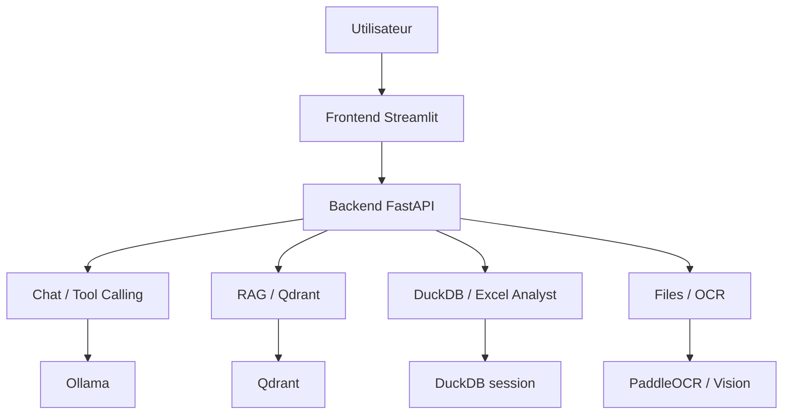
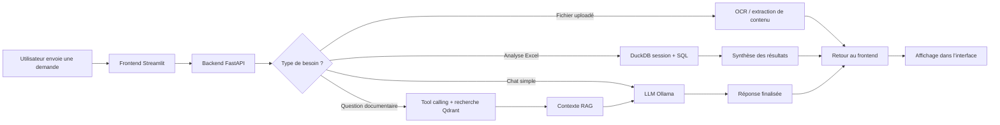

# Chatbot IA & Assistant de données

Ce projet est un assistant conversationnel orienté entreprise, capable de répondre à partir de documents, de traiter des fichiers Excel et d’exécuter des analyses de données à partir d’un modèle LLM local. Il combine une interface web Streamlit, une API FastAPI, une couche de recherche vectorielle (RAG) et des outils d’analyse de fichiers structurés ou non structurés.

Le système est conçu pour fonctionner avec des modèles LLM hébergés localement via Ollama, avec un backend FastAPI dédié et un frontend Streamlit pour l’interaction utilisateur.

## Aperçu du projet

Le dépôt contient :

- un backend FastAPI pour la logique IA, le RAG, le chat et les traitements fichiers
- un frontend Streamlit pour l’interface utilisateur
- un service Ollama pour l’inférence des modèles
- un service Qdrant pour le stockage vectoriel
- une base DuckDB en mémoire par session pour les analyses Excel
- des capacités OCR / vision et extraction de texte sur documents et images

## Fonctionnalités principales

- Chat conversationnel simple avec LLM
- Chat avec tool calling dynamique pour décider s’il faut interroger une base documentaire
- Recherche documentaire augmentée par récupération (RAG) sur des collections vectorielles
- Analyse de fichiers Excel et génération de requêtes SQL DuckDB
- Visualisation de résultats sous forme de graphiques via le modèle et la logique de synthèse
- Import de fichiers (texte, PDF, image, tableur, document Office)
- OCR et extraction de texte à partir d’images / PDF
- Gestion de sessions utilisateur pour l’analyse de données
- Interface web construite avec Streamlit
- Déploiement conteneurisé avec Docker Compose

## Architecture



## Flux de traitement



## Stack technique

- Frontend : Streamlit
- Backend : FastAPI, Pydantic, Uvicorn
- Modèles LLM : Ollama
- RAG / vector search : Qdrant + embeddings
- Analyse data : DuckDB, Polars, pandas, pyarrow
- OCR / documents : PaddleOCR, Pillow, pdf2image, pdfplumber, python-docx, python-pptx
- Conteneurisation : Docker, Docker Compose

## Structure du dépôt

```text
chatbot/
├── backend/
│   ├── API_routes/
│   │   ├── chat.py
│   │   ├── rag.py
│   │   ├── excel_tool.py
│   │   └── files.py
│   ├── core/
│   │   ├── config.py
│   │   ├── duckdb_session.py
│   │   └── mots_cle.py
│   ├── external_tools/
│   │   └── rag_engine.py
│   ├── services/
│   │   ├── ollama_client.py
│   │   ├── llm_vision.py
│   │   └── paddle_ocr_processor.py
│   ├── utils/
│   ├── main.py
│   ├── requirements_backend.txt
│   └── Dockerfile
├── frontend/
│   ├── pages/
│   ├── plugins/
│   ├── chatbot_page_utility/
│   ├── debug_files/
│   ├── Main.py
│   ├── requirements_frontend.txt
│   └── Dockerfile
├── _data/
├── docker-compose.yml
├── requirements.txt
├── .gitignore
├── readme.md
└── ...
```

## Prérequis

Avant de lancer le projet, vous devez avoir :

- Docker et Docker Compose installés
- Ollama installé et accessible depuis le réseau de votre environnement
- Un service Qdrant accessible ou une configuration Docker réseau dédiée
- Optionnel : GPU NVIDIA pour accélérer les modèles LLM / OCR

## Configuration rapide

Le projet est principalement piloté par le fichier `docker-compose.yml`.

Les variables importantes incluent :

- `OLLAMA_HOST` : URL du serveur Ollama
- `CONTEXT_SIZE` : taille du contexte LLM
- `TEMPERATURE` : température de génération
- `DEFAULT_LLM` : modèle principal pour le chat
- `EMBEDDING_MODEL` : modèle utilisé pour les embeddings RAG
- `QDRANT_HOST` et `QDRANT_PORT` : connexion à Qdrant
- `CHATBOT_ROLE` : rôle de l’assistant pour le filtrage des collections
- `API_URL` : adresse du backend côté frontend
- `IS_DEV` : active les pages de dev dans l’interface Streamlit

## Démarrage avec Docker Compose

1. Clonez le dépôt 

2. Vérifiez la configuration Docker :

- le fichier `docker-compose.yml` pointe sur les services backend et frontend
- le backend attend un accès Ollama et Qdrant
- si le réseau Qdrant est externe, vérifiez qu’il existe bien

3. Lancez les services :

```bash
docker compose up --build -d
```

4. Vérifiez les services :

- Frontend : http://localhost:8501
- Backend API : http://localhost:8000/docs

5. Pour arrêter le projet :

```bash
docker compose down
```

## Utilisation

### Interface web

La page principale est le chatbot Streamlit. Elle permet :

- d’envoyer des messages au backend
- de discuter avec le modèle principal
- d’importer des fichiers pour analyse ou OCR
- d’accéder aux outils de données Excel
- de consulter la page de changelog en mode dev

### API backend

Le backend expose plusieurs routes principales :

- `POST /chat` : chat standard sans RAG
- `POST /chat_with_tools` : chat avec évaluation de l’usage d’outils et recherche documentaire si nécessaire
- `POST /rag/search` : recherche hybride dans une collection Qdrant
- `POST /rag/registry_evolve` : liste les collections accessibles selon le rôle du chatbot
- `POST /excel_tool/parse_excel` : upload d’un fichier Excel et création d’une session DuckDB
- `POST /excel_tool/chat_data_analyst` : génération SQL et analyse à partir d’un fichier Excel
- `POST /files/upload_fichier` : traitement d’un fichier uploadé pour extraction de contenu / OCR

## Exemple de flux fonctionnel

1. L’utilisateur ouvre l’interface Streamlit.
2. Le frontend envoie des messages au backend FastAPI.
3. Le backend décide :
   - répondre directement avec le LLM,
   - ou utiliser une recherche documentaire dans Qdrant,
   - ou analyser un fichier Excel avec DuckDB.
4. Les résultats sont renvoyés à l’interface et affichés en conversation.

## Développement local

Pour un développement directement sur le machine hôte, il est possible d’installer séparément les dépendances Python :

```bash
pip install -r backend/requirements_backend.txt
pip install -r frontend/requirements_frontend.txt
```

Ensuite, vous pouvez lancer :

```bash
cd backend
uvicorn main:app --reload --host 0.0.0.0 --port 8000
```

```bash
cd frontend
streamlit run Main.py
```

## Points d’attention

- L’environnement dépend fortement d’un serveur Ollama opérationnel.
- Le RAG dépend d’un service Qdrant et d’indices de documents correctement chargés.
- Les performances de l’OCR / vision et de la génération peuvent être variables selon la machine et le modèle choisi.
- La configuration GPU est optionnelle mais recommandé pour les usages lourds.

## Sécurité et confidentialité

Le projet est conçu pour fonctionner en mode local ou interne, avec les modèles sont eux-mêmes hébergés localement via Ollama. Cela permet de limiter l’exposition des données à des services externes. Cependant, les données doivent tout de même être contrôlées selon les règles de votre environnement et le niveau de sensibilité des fichiers traités.

